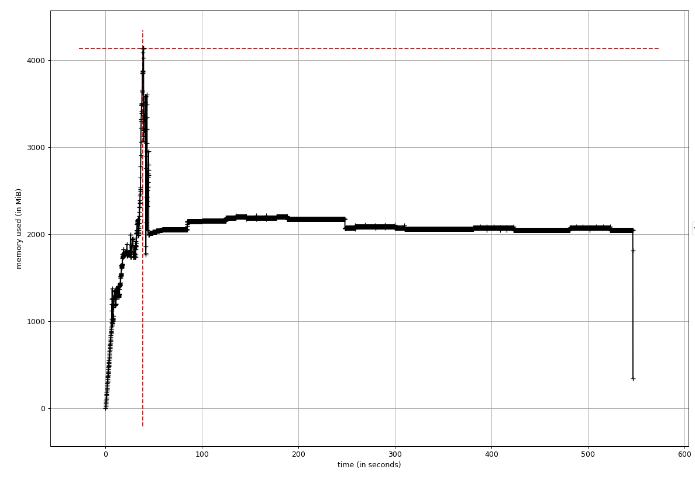
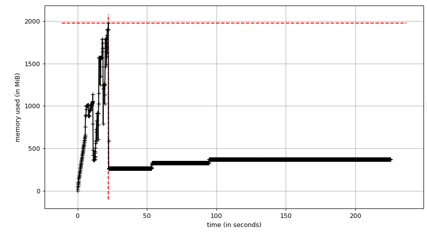

# Data Analysis Pipeline

The purpose of the pipeline in this repository is to provide analysis tools that can eliminate and reduce boring and repetitive tasks in data analysis.

## Pipeline

"my_pipeline" directory provides analysis tools for load/save files, data cleaning/feature engineering and modelling. The pipeline can be used for future data analysis and reduce coding tasks.

## Analysis Codes

In this repository, there are two codes to analyse data:

- TitanicSurvivorPrediction.py  

- UberDemandPrediction.py  
  
These analysis codes were developed based on the insights obtained from Exploratory Data Analysis (EDA) on a jupyter notebook (see links below).
Titanic survival prediction is a binary classification task and Uber demand forecasting is time-series forecasting. These are different types of tasks, but some basic analysis can be done with common analysis tools.

## Links

**(Titanic survivor prediction)**  
Jupyter Notebook  
https://github.com/shotashirai/Data-Analysis-Pipeline/blob/main/EDA_Jupyter_Notebook/TitanicSurvivalPrediction_EDA_Model.ipynb  
Original Repository  
https://github.com/shotashirai/Titanic-Survival-Prediction  

**(Uber Demand Forecasting)**  
Jupyter Notebook  
https://github.com/shotashirai/Data-Analysis-Pipeline/blob/main/EDA_Jupyter_Notebook/Uber-Demand-Forecasting_EDA_Model.ipynb  
Original Repository  
https://github.com/shotashirai/Uber-Demand-Forecasting-NYC  

## Optimization of the Code - UberDemandForecasting 

(Updated: 31 Oct 2021)

### Review of the code

For the initial review of the codes, `cProfile`, `line_profiler` and `memory_profiler` were used.
Also, to measure memory usage of a pandas dataframe, `df.info(memory_usage='deep')` and  `df.memory_usage()`  are used.
The profile (.stats) obtained by `python -m cProfile -o file_name.stats my_script.py` can be visualized using `snakeviz file_name.stats`

These tools found that:

- `data_profile()` spent ~37s to obtained the information of the dataframe, especially duplication check is the most time consuming.

- `datetime_format()` is also time consuming (`10s)

- Multiple Pandas dataframes occupy RAM, which may affect the performance of the `data_profile()`.

- Modelling section is significantly time consuming (10min to get results), especially feature selection using **BorutaPy**.

### Optimization methods

- Replace custom-made function with built-in function where possible.

- Use memory efficient datatypes based on EDA.

- Do NOT create/copy unnecessary dataframes.

- Restructure the code.

*Multiprocessing on CPU is already used in some models.
**Multiprocessing on GPU is not consider in this time.

### Optimization

#### Datatypes in dataframes

The datatypes automatically selected by Pandas are usually int64, float64 or object which needs more memory. To reduce the memory usage, 'right' datatypes (int16, int8, float32, category) were selected based on the insights from EDA. 
The result of the optimization of the datatypes is shown on the table below. Memory usage for dataframes of Uber data and weather data were drastically improved.

|              | Before optimization | After optimization |
| ------------ | ------------------- | ------------------ |
| Uber data    | 4.4 GB              | 122.5MB            |
| Weather data | 564.6 KB            | 82.4 KB            |
| Location ref | 37.8KB              | 1.6 KB             |
| df_model     | 8.2MB               | 7.9MB              |

*` df.info(memory_usage='deep')` is used for memory usage measurements.

#### BorutaPy

Boruta is a strong feature selection algorithm designed as a wrapper around a Random Forest classification algorithm. However, it is ***slow***. In this code, the feature selection by Boruta is the main bottleneck for efficient computation. Boruta is basically implemented with Random Forest classification, but other models can be used and result in better performance. (ref: https://github.com/scikit-learn-contrib/boruta_py/issues/80)

To compare the performance, three regressor models (Random Forest, XGBoost, lightGBM) were tested. The table below shows the elapsed time to select features and accuracy of the prediction (MAPE: Mean Absolute Percentage Error). All models shows very similar accuracy values (1.6 +/- 0.1%), but lightGBM shows a significant performance for efficient computation. So, optimized version of the code, **lightGBM** is used for feature selection with BorutaPy.

| Model                   | Elapsed time | Accuracy (MAPE) |
| ----------------------- | ------------ | --------------- |
| Random Forest Regressor | ~176 s       | 1.7%            |
| XGBoost                 | ~170 s       | 1.5%            |
| lightGBM                | ~26 s        | 1.63%           |

#### Restructuring code

##### Import data

This section loads data and prepare for further analysis in later sections.

- `load_file()` was removed due to less flexibility to load files.

- A code to load data from csv files was directly written on the main code to select data attributes and proper datatypes.

- Weather data is loaded using `glob` module that allows getting a list of files in a directory. Datatypes are selected after generating a weather dataframe (`df_weather`).

- Weather data with a period (2015-01-01 - 2015-06-30) is extracted in loading section, leading to memory usage reduction.

To create/format dataframe is done in this section and the the section of 'Preprocessing for analysis' is not needed anymore.

##### Preprocessing

"Preprocessing" section get a hourly statistics of Uber rides and concatenates the Uber data and the weather data.

- A single dataframe (`df_uber_hourly`) obtained from the original Uber dataframe contains all required variables.

- `df_model` used for modelling are created from `df_uber_hourly` and `df_weather`.

While the old code generated multiple dataframes, the optimized code minimizes creating dataframes which helps to reduce memory usage.

##### Model Deployment

This section builds and trains XGBoost model and implement time-series forecasting using the trained model. 

- `prediction_XGBoost()` is removed because it is complicated and is likely to cause low readability and  maintainability.

- `TimeSeries_XGBoost()` was created. This function simply train and return predicted values for time-series data. XGBoost (regressor) is used as a model.

- Model building and feature selection have been done outside of the model deployment function. This way make it easy to read the code and tune parameters.

- As mentioned in the section above (BorutaPy), lightGBM is used for feature selection with BorutaPy.

##### Function: data_profile()

This function returns profile of a dataframe. To improve the performance,

- replace an original method with built-in function

- reduce dataframes created and use a single dataframe to store the information

##### Function: gen_lagdata()

This function is used for generating lag feature. In the optimized version,

- removed `df.copy()`

- reduce variables created

- use `df.shift(lag)` to generate lag feature and  `df.drop()` to remove NaN values.

These changes made the function simple and short.

### Results of Optimization

#### Time Efficiency

 `time python UberDemandPrediction.py` measures the elapsed time to run entire code. Elapsed time for each code section wa measured with `time()` module.
 As shown on the table below, the performance of the code is significantly improved (reduce computation time by ~60%) after optimization.

|                             | Before optimization | After optimization |
| --------------------------- | ------------------- | ------------------ |
| Elapsed time (real)         | 14m36s              | 4m21s              |
| (Section)                   |                     |                    |
| Import data - preprocessing | 19.7s               | 11.3s              |
| Data Profile                | 37.2s               | 2.1s               |
| Preprocessing               | 9.4s                | 8.6s               |
| Feature Engineering         | 0.5s                | 0.2s               |
| Model Deployment            | 513s                | 186s               |

#### Memory usage

##### Memory usage of the major dataframes

Memory usage for major dataframes is also drastically improved by using proper datatypes as shown below.

|              | Before optimization | After optimization |
| ------------ | ------------------- | ------------------ |
| Uber data    | 4.4 GB              | 122.5MB            |
| Weather data | 564.6 KB            | 82.4 KB            |
| Location ref | 37.8KB              | 1.6 KB             |
| df_model     | 8.2MB               | 7.9MB              |

*` df.info(memory_usage='deep')` is used for memory usage measurements.

##### Memory usage in time

`mprof run -M python UberDemandPrediction.py` measures the memory usage over time and `mprof plot` provides a trace of the memory usage. 

**--- Before Optimization ---**

- Peak memory consumption is ~4GB
- The memory usage stayed on ~2GB after the peak

**--- After Optimization ---**

- Peak memory consumption is ~2GB
- The memory usage stayed on below 500MB after the peak

#### Readability of the code

After optimization, readability of the code is enhanced.

### Note

- **test** directory contains the test code used for optimization.
- **archived** directory contains the old code.
- **code_profile** directory stores profile obtained by `cProfile`. These can be visualized using `snakeviz UberProfile.stats`

## Review of the code - Titanic Survivor Prediction

The code for titanic survivor prediction has a small bug (feature selection was implemented for each model). To fix the bugs, `cls_model_deployer()` was modified.
The elapsed time before and after fixing the bugs are shown on the table below. As can be seen, the performance of the code is slightly improved.

|                             | Before fixing bugs  | After fixing bugs  |
| --------------------------- | ------------------- | ------------------ |
| Elapsed time (real)         | 44s                 | 31s                |
